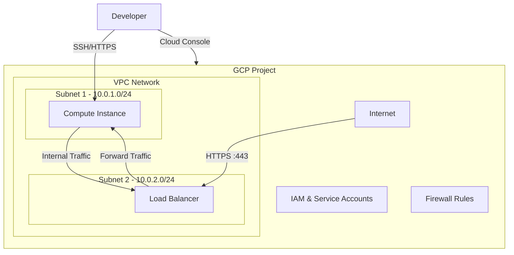

# 🚀 VS Code Server on Google Cloud Platform

[](https://www.terraform.io/)
[](https://cloud.google.com/)
[](https://opensource.org/licenses/MIT)

A production-grade Terraform module for deploying VS Code Server on Google Cloud Platform with security, scalability, and maintainability in mind.

## 🏗 Architecture



## ✨ Features

- **Secure by Default**
  - VPC with private subnets
  - IAP-secured SSH access
  - HTTPS with Let's Encrypt certificates
  - OS Login integration
  - Minimal IAM permissions

- **Scalable**
  - Instance templates for easy scaling
  - Managed instance groups
  - Load balancer ready
  - Regional deployment options

- **Maintainable**
  - Modular design
  - Comprehensive documentation
  - Consistent tagging and labeling
  - Automated backups

## 📋 Table of Contents

- [VS Code Server on GCP](#-vs-code-server-on-google-cloud-platform)
  - [🏗 Architecture](#-architecture)
  - [✨ Features](#-features)
  - [📋 Table of Contents](#-table-of-contents)
  - [🚀 Getting Started](#-getting-started)
    - [Prerequisites](#prerequisites)
    - [Quick Start](#quick-start)
  - [🛠 Configuration](#-configuration)
    - [Required Variables](#required-variables)
    - [Optional Variables](#optional-variables)
    - [Example Configuration](#example-configuration)
  - [🏗 Project Structure](#-project-structure)
  - [🚀 Deployment](#-deployment)
    - [Initial Setup](#initial-setup)
    - [Apply Configuration](#apply-configuration)
    - [Accessing VS Code Server](#accessing-vs-code-server)
  - [🔧 Operations](#-operations)
    - [Scaling](#scaling)
    - [Updates](#updates)
    - [Backups](#backups)
    - [Monitoring](#monitoring)
  - [🔒 Security](#-security)
    - [Network Security](#network-security)
    - [IAM Permissions](#iam-permissions)
    - [Secrets Management](#secrets-management)
  - [📈 Monitoring & Logging](#-monitoring--logging)
  - [🧪 Testing](#-testing)
  - [🧩 Modules](#-modules)
  - [🤝 Contributing](#-contributing)
  - [📄 License](#-license)
  - [🙏 Acknowledgments](#-acknowledgments)

## 🚀 Getting Started

### Prerequisites

1. **Google Cloud Account**
   - Active GCP project with billing enabled
   - Required APIs enabled (see below)
   - IAM permissions to create resources

2. **Local Development Environment**
   - Terraform >= 1.3.0
   - Google Cloud SDK (gcloud)
   - Git
   - SSH client

3. **GCP APIs**
   ```bash
   gcloud services enable \
     compute.googleapis.com \
     iam.googleapis.com \
     cloudresourcemanager.googleapis.com \
     serviceusage.googleapis.com \
     dns.googleapis.com \
     cloudbuild.googleapis.com
   ```

### Quick Start

1. **Clone the repository**
   ```bash
   git clone https://github.com/your-org/vscode-server-gcp.git
   cd vscode-server-gcp/terraform
   ```

2. **Initialize Terraform**
   ```bash
   terraform init
   ```

3. **Configure variables**
   Create a `terraform.tfvars` file with your configuration:
   ```hcl
   project_id         = "your-project-id"
   vscode_domain      = "code.yourdomain.com"
   vscode_password    = "your-secure-password"
   letsencrypt_email  = "your-email@example.com"
   credentials_file   = "path/to/credentials.json"
   ```

4. **Plan and apply**
   ```bash
   terraform plan -out=tfplan
   terraform apply tfplan
   ```

5. **Access VS Code Server**
   ```
   https://code.yourdomain.com
   ```

## 🛠 Configuration

### Required Variables

| Name | Description | Type | Default |
|------|-------------|------|---------|
| `project_id` | GCP Project ID where resources will be created | `string` | - |
| `vscode_domain` | Domain name for VS Code Server | `string` | - |
| `vscode_password` | Password for VS Code Server | `string` | - |
| `letsencrypt_email` | Email for Let's Encrypt certificates | `string` | - |
| `credentials_file` | Path to GCP service account key file | `string` | - |

### Optional Variables

| Name | Description | Type | Default |
|------|-------------|------|---------|
| `environment` | Deployment environment (dev/staging/prod) | `string` | `"production"` |
| `region` | GCP region for resources | `string` | `"europe-west2"` |
| `zone` | GCP zone for compute resources | `string` | `"europe-west2-b"` |
| `machine_type` | Compute instance type | `string` | `"e2-micro"` |
| `boot_disk_size_gb` | Boot disk size in GB | `number` | `30` |
| `enable_monitoring` | Enable Cloud Monitoring | `bool` | `true` |
| `enable_backup` | Enable automated backups | `bool` | `false` |
| `admin_ip_cidr` | Admin IP CIDR for access | `string` | `"0.0.0.0/0"` |

### Example Configuration

```hcl
# terraform.tfvars
project_id         = "my-vscode-project"
region             = "europe-west2"
zone               = "europe-west2-b"
environment        = "production"
vscode_domain      = "code.example.com"
vscode_password    = "ChangeMe123!"
letsencrypt_email  = "admin@example.com"
credentials_file   = "~/.config/gcloud/credentials.json"

# Optional overrides
machine_type       = "e2-medium"
boot_disk_size_gb  = 50
enable_monitoring  = true
enable_backup      = true
admin_ip_cidr      = "203.0.113.42/32"

# Additional tags
additional_tags = {
  team        = "devops"
  cost-center = "engineering"
  repository  = "github.com/org/vscode-server-gcp"
}
```

## 🏗 Project Structure

```
terraform/
├── main.tf              # Main configuration file
├── variables.tf         # Input variables
├── outputs.tf           # Output values
├── versions.tf          # Provider and Terraform versions
├── locals.tf            # Local values and computed variables
├── network.tf           # VPC and network resources
├── compute.tf           # Compute resources
├── iam.tf               # IAM policies and roles
├── dns.tf               # DNS configuration
├── monitoring.tf        # Monitoring and alerting
├── backup.tf            # Backup configuration
└── README.md            # This file
```

## 🚀 Deployment

### Initial Setup

1. **Clone the repository**
   ```bash
   git clone https://github.com/your-org/vscode-server-gcp.git
   cd vscode-server-gcp/terraform
   ```

2. **Initialize Terraform**
   ```bash
   terraform init
   ```

3. **Configure variables**
   Copy the example configuration and update with your values:
   ```bash
   cp terraform.tfvars.example terraform.tfvars
   # Edit terraform.tfvars with your configuration
   ```

### Apply Configuration

1. **Review the execution plan**
   ```bash
   terraform plan -out=tfplan
   ```

2. **Apply the configuration**
   ```bash
   terraform apply tfplan
   ```

3. **Verify the deployment**
   ```bash
   terraform output
   ```

### Accessing VS Code Server

1. **Via Web Browser**
   ```
   https://your-domain.com
   ```

2. **Via SSH**
   ```bash
   gcloud compute ssh vscode-server-vm-0 --zone=your-zone
   ```

## 🔧 Operations

### Scaling

To scale the number of instances:

1. Update the `num_instances` variable
2. Apply the changes:
   ```bash
   terraform apply -var="num_instances=3"
   ```

### Updates

To update the VS Code Server version:

1. Update the version in the startup script
2. Apply the changes:
   ```bash
   terraform apply -replace=module.compute_instance.google_compute_instance.vscode
   ```

### Backups

Automated backups can be enabled by setting `enable_backup = true`.

### Monitoring

Cloud Monitoring is enabled by default. View metrics in the GCP Console:

```
https://console.cloud.google.com/monitoring
```

## 🔒 Security

### Network Security

- VPC with private subnets
- IAP-secured SSH access
- HTTPS with Let's Encrypt
- Web Application Firewall (WAF) rules

### IAM Permissions

Minimal IAM roles are assigned following the principle of least privilege.

### Secrets Management

- Use Google Secret Manager for sensitive data
- Never commit secrets to version control
- Rotate credentials regularly

## 📈 Monitoring & Logging

- **Cloud Monitoring** for metrics
- **Cloud Logging** for logs
- **Error Reporting** for application errors
- **Uptime Checks** for availability

## 🧪 Testing

1. **Linting**
   ```bash
   terraform fmt -check
   terraform validate
   ```

2. **Security Scanning**
   ```bash
   tfsec .
   checkov -d .
   ```

## 🧩 Modules

This project uses the following modules:

- **Network Module**: VPC, subnets, and firewall rules
- **Compute Module**: VM instances and templates
- **IAM Module**: Service accounts and permissions
- **DNS Module**: DNS records and certificates

## 🤝 Contributing

Contributions are welcome! Please follow these steps:

1. Fork the repository
2. Create a feature branch
3. Commit your changes
4. Push to the branch
5. Submit a pull request

## 📄 License

This project is licensed under the MIT License - see the [LICENSE](LICENSE) file for details.

## 🙏 Acknowledgments

- [VS Code Server](https://github.com/cdr/code-server)
- [Terraform Google Provider](https://registry.terraform.io/providers/hashicorp/google/latest/docs)
- [Google Cloud](https://cloud.google.com/)
- [Let's Encrypt](https://letsencrypt.org/)

---

<div align="center">
  Made with ❤️ by Your Team Name
</div>
- **Secure Access** with firewall rules and IAP SSH
- **Custom VPC Network** with regional routing
- **SSL/TLS Support** with self-signed certificates
- **Multiple Access Methods** (HTTP/HTTPS)
- **Standardized Infrastructure** with proper tagging and naming

## 🏗 Architecture

```
┌─────────────────────────────────────────────────┐
│                   GCP Project                   │
│  ┌─────────────────────────────────────────────┐│
│  │            VPC Network                      ││
│  │  mbtux-dev-core-euw1-vpc-01                ││
│  │                                             ││
│  │  ┌─────────────────┐  ┌─────────────────┐  ││
│  │  │     Subnet 1    │  │     Subnet 2    │  ││
│  │  │ 100.64.0.0/24   │  │ 100.64.1.0/24   │  ││
│  │  │   euw1-sbt-01   │  │   euw1-sbt-02   │  ││
│  │  └─────────────────┘  └─────────────────┘  ││
│  └─────────────────────────────────────────────┘│
└─────────────────────────────────────────────────┘
```

## ✅ Prerequisites

### Required Tools
- [Terraform](https://www.terraform.io/downloads.html) >= 1.0
- [Google Cloud CLI](https://cloud.google.com/sdk/docs/install) (`gcloud`)
- A Google Cloud Platform account with billing enabled

### Required Permissions
The service account must have the following roles:
- `Compute Network Admin` - For VPC and subnet management
- `Service Account User` - For resource creation

### Authentication Setup

1. **Service Account Authentication** (Recommended):
   ```bash
   # Place your service account key file in the secrets/ directory
   cp /path/to/your/service-account-key.json secrets/
   ```

2. **Alternative: Application Default Credentials**:
   ```bash
   gcloud auth application-default login
   ```

## 💻 VS Code Server Access

After deployment, you can access VS Code Server through multiple methods:

### 🌐 Web Access (Recommended)
- **HTTP**: `http://<instance-external-ip>:8080`
- **HTTPS**: `https://<instance-external-ip>:8443` (Self-signed certificate)
- **Password**: `P@ssw0rd@123`
- **Access**: Restricted to your IP address (208.127.201.111)

### 🔐 SSH Access
- **Method**: Identity-Aware Proxy (IAP)
- **Access**: Via Google Cloud Console SSH or `gcloud compute ssh`
- **Security**: No direct SSH port exposure

### 🔧 Instance Management
- **Instance Type**: e2-micro (cost-optimized)
- **OS**: Debian 11
- **Disk Size**: 10GB
- **Auto-start**: Code-server runs as systemd service

## 📁 Project Structure

```
terraform/
├── README.md                 # This documentation file
├── provider.tf              # Terraform providers and versions
├── variables.tf             # Input variable definitions
├── terraform.tfvars         # Variable values (customize this)
├── locals.tf               # Local values and computed expressions
├── labels.tf               # Resource labeling module
├── network.tf              # VPC network, firewall rules
├── compute.tf              # VS Code Server instance and template
├── scripts/                # External scripts for maintainability
│   └── install-vscode-server.sh  # VS Code Server installation script
├── secrets/                # Service account credentials
│   └── *.json             # GCP service account key files
└── .terraform/            # Terraform working directory (auto-generated)
```

## 🔧 DRY and Clean Code Features

This project follows infrastructure-as-code best practices with:

- **📝 Externalized Scripts**: Large startup scripts moved to separate files
- **🔄 Reusable Locals**: Common configuration values centralized
- **🎯 Variable-Driven**: All hardcoded values parameterized
- **📋 Template Functions**: Dynamic script configuration via `templatefile()`
- **🏷️ Consistent Naming**: Standardized resource naming patterns
- **🔐 Secure Defaults**: Security-first configuration approach

## ⚙️ Configuration

### 1. Copy and customize variables
```bash
# Edit terraform.tfvars with your project-specific values
cp terraform.tfvars.example terraform.tfvars
```

### 2. Update terraform.tfvars
```hcl
# Required variables
project_id       = "your-gcp-project-id"
region          = "europe-west2"
zone            = "europe-west2-a"
credentials_file = "secrets/your-service-account-key.json"

# Instance configuration
machine_type    = "e2-micro"
boot_disk_image = "debian-cloud/debian-11"

# Service account configuration
service_account = {
  email  = "your-service-account@your-project.iam.gserviceaccount.com"
  scopes = ["https://www.googleapis.com/auth/cloud-platform"]
}

# VS Code Server configuration
vscode_domain     = "vscode.yourdomain.com"  # Your custom domain
letsencrypt_email = "admin@yourdomain.com"   # Your admin email
vscode_password   = "YourSecurePassword123"  # Change this password
admin_ip_cidr     = "YOUR.PUBLIC.IP.ADDRESS/32"  # Your public IP for access
```

### 3. Customize locals.tf
```hcl
# Update local values to match your naming convention
locals {
  name        = "your-app-dev"      # Application name and environment
  managed_by  = "your-email@domain.com"  # Resource manager contact
  environment = "core"              # Environment identifier
}
```

## 🚀 Usage

### Initialize Terraform
```bash
# Initialize the working directory
terraform init
```

### Plan Infrastructure Changes
```bash
# Review what will be created/modified
terraform plan
```

### Apply Configuration
```bash
# Create the infrastructure
terraform apply
```

### Access VS Code Server
```bash
# Get the external IP address
terraform output | grep external_ip

# Or use gcloud to get the IP
gcloud compute instances list --filter="name:instance-01"

# Access via web browser
# HTTP:  http://EXTERNAL_IP:8080
# HTTPS: https://EXTERNAL_IP:8443
# Password: P@ssw0rd@123
```

### Monitor Installation (Optional)
```bash
# SSH into the instance to check code-server status
gcloud compute ssh INSTANCE_NAME --zone=ZONE

# Check installation logs
sudo tail -f /var/log/code-server-install.log

# Check service status
sudo systemctl status code-server
```

### Destroy Infrastructure (if needed)
```bash
# Remove all created resources
terraform destroy
```

## 🔧 Resources Created

| Resource Type | Name Pattern | Description |
|---------------|--------------|-------------|
| **VPC Network** | `{name}-vpc-01` | Custom VPC with regional routing |
| **Subnet 1** | `{name}-sbt-01` | First subnet (100.64.0.0/24) |
| **Subnet 2** | `{name}-sbt-02` | Second subnet (100.64.1.0/24) |
| **Firewall Rule (SSH)** | `{name}-allow-ssh-iap` | SSH access via Identity-Aware Proxy |
| **Firewall Rule (Web)** | `{name}-allow-8080-personal` | HTTP access on port 8080 |
| **Instance Template** | `default-instance-template-*` | VS Code Server template |
| **Compute Instance** | `{name}-instance-01-001` | VS Code Server instance (e2-micro) |
| **Routes** | `{name}-egress-internet` | Internet gateway route |

Where `{name}` follows the pattern: `{app}-{env}-{business_unit}-{region}`

Example: `mbtux-dev-core-euw1-vpc-01`

### 💻 VS Code Server Configuration

- **Operating System**: Debian 11
- **Instance Type**: e2-micro (1 vCPU, 1GB RAM)
- **Disk Size**: 10GB SSD
- **Code-server Version**: Latest (installed via official script)
- **SSL Certificates**: Self-signed (auto-generated)
- **Service Management**: systemd service with auto-restart

## 🏷 Labels and Tagging

All resources are automatically tagged using the `labels` module with:

| Label Key | Description | Example Value |
|-----------|-------------|---------------|
| `Application` | Application identifier | `mbtux` |
| `Business_unit` | Organizational unit | `Corp` |
| `Environment` | Environment type | `core` |
| `Managed_by` | Resource manager | `mrbhardw@gmail.com` |
| `Name` | Resource identifier | `mbtux-dev` |
| `Created_by` | Creation method | `terraform` |

## 📥 Variables

### Required Variables

| Variable | Type | Description |
|----------|------|-------------|
| `project_id` | `string` | GCP project ID |
| `credentials_file` | `string` | Path to service account JSON |

### Optional Variables

| Variable | Type | Default | Description |
|----------|------|---------|-------------|
| `region` | `string` | `us-central1` | GCP region for resources |

## 📤 Outputs

| Output | Description |
|--------|-------------|
| `name` | Generated resource name prefix |
| `network_name` | VPC network name |
| `subnets_names` | List of subnet names |
| `subnets_ips` | List of subnet CIDR ranges |

## 💡 Examples

### Basic VS Code Server Setup
```hcl
# terraform.tfvars
project_id       = "my-gcp-project"
region          = "europe-west2"
zone            = "europe-west2-a"
credentials_file = "secrets/my-service-account.json"
machine_type    = "e2-micro"

service_account = {
  email  = "terraform-sa@my-gcp-project.iam.gserviceaccount.com"
  scopes = ["https://www.googleapis.com/auth/cloud-platform"]
}
```

### Production Setup (Larger Instance)
```hcl
# terraform.tfvars
project_id      = "my-gcp-project"
region         = "us-central1"
zone           = "us-central1-a"
machine_type   = "e2-standard-2"  # 2 vCPU, 8GB RAM for better performance

service_account = {
  email  = "terraform-sa@my-gcp-project.iam.gserviceaccount.com"
  scopes = ["https://www.googleapis.com/auth/cloud-platform"]
}
```

### Custom Naming
```hcl
# locals.tf
locals {
  name        = "myapp-prod"
  managed_by  = "devops@company.com"
  environment = "production"
}
```

## 🔍 Troubleshooting

### Common Issues

1. **Authentication Errors**
   ```bash
   # Verify gcloud authentication
   gcloud auth list
   
   # Check service account file exists
   ls -la secrets/
   ```

2. **Permission Denied**
   ```bash
   # Verify project permissions
   gcloud projects get-iam-policy PROJECT_ID
   ```

3. **VS Code Server Not Accessible**
   ```bash
   # Check if instance is running
   gcloud compute instances list
   
   # Check firewall rules
   gcloud compute firewall-rules list --filter="name:allow-8080"
   
   # Verify your public IP
   curl -s ifconfig.me
   ```

4. **Code-server Installation Issues**
   ```bash
   # SSH into instance and check logs
   gcloud compute ssh INSTANCE_NAME --zone=ZONE
   
   # Check startup script execution
   sudo journalctl -u google-startup-scripts
   
   # Check code-server service
   sudo systemctl status code-server
   
   # Restart code-server if needed
   sudo systemctl restart code-server
   ```

5. **Network Already Exists**
   ```bash
   # Import existing network
   terraform import module.network.module.vpc.google_compute_network.network PROJECT_ID/NETWORK_NAME
   ```

6. **SSL Certificate Warnings**
   - **Issue**: Browser shows SSL warning for HTTPS access
   - **Solution**: This is expected with self-signed certificates
   - **Options**:
     - Use HTTP access on port 8080 (no SSL warnings)
     - Accept the certificate warning and proceed
     - Replace with a valid certificate if needed

### Validation Commands

```bash
# Validate Terraform configuration
terraform validate

# Format Terraform files
terraform fmt -recursive

# Check for security issues
terraform plan -out=tfplan
```

## 🤝 Contributing

1. **Fork the repository**
2. **Create a feature branch**: `git checkout -b feature/amazing-feature`
3. **Commit changes**: `git commit -m 'Add amazing feature'`
4. **Push to branch**: `git push origin feature/amazing-feature`
5. **Open a Pull Request**

### Coding Standards

- Use consistent naming conventions
- Add comments for complex logic
- Update documentation for new features
- Test changes with `terraform plan`

## 📞 Support

For questions or issues:

- **Email**: mrbhardw@gmail.com
- **Project Issues**: Create a GitHub issue
- **Documentation**: Check this README first

## 📜 License

This project is licensed under the MIT License - see the LICENSE file for details.

---

**Generated by**: Terraform with ❤️  
**Last Updated**: October 2025  
**Version**: 1.0.0