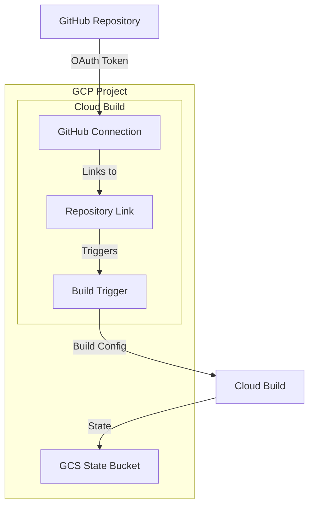

# 🚀 Bootstrap Infrastructure

[](https://www.terraform.io/) [](https://cloud.google.com/)

This Terraform configuration sets up the foundational infrastructure for CI/CD pipelines on Google Cloud Platform. It creates the necessary resources for Cloud Build integration with GitHub, including connections, repositories, triggers, and state storage.

## 🏗 Architecture



## ✨ Features

- **GitHub Integration**: Secure connection between GCP and GitHub using OAuth tokens
- **Automated Triggers**: Push-based build triggers for continuous deployment
- **State Management**: Remote Terraform state storage in GCS
- **Service Accounts**: Proper IAM configuration for Cloud Build operations
- **Version Control**: State bucket versioning and lifecycle management

## 📋 Prerequisites

### Required Tools
- [Terraform](https://www.terraform.io/downloads.html) >= 1.5.0
- [Google Cloud CLI](https://cloud.google.com/sdk/docs/install) (`gcloud`)
- A Google Cloud Platform account with billing enabled

### Required Permissions
The service account must have the following roles:
- `Cloud Build Editor` - For managing Cloud Build resources
- `Secret Manager Secret Accessor` - For accessing GitHub OAuth tokens
- `Storage Admin` - For managing state buckets

### GitHub Setup
1. **GitHub App Installation**: Install the Google Cloud Build GitHub App
2. **OAuth Token**: Store the GitHub token in Google Secret Manager
3. **Repository Access**: Ensure the app has access to your repository

## 💻 Configuration

### Variables

| Variable | Description | Type | Default |
|----------|-------------|------|---------|
| `project_id` | GCP Project ID | `string` | `"solid-choir-472607-r1"` |
| `region` | GCP Region | `string` | `"europe-west4"` |
| `github_owner` | GitHub repository owner | `string` | `"mrbhardw-dev"` |
| `github_repo` | GitHub repository name | `string` | `"vscode-server-remote-dev"` |
| `cloudbuild_config_path` | Path to Cloud Build config | `string` | `"infra/workload/cloudbuild.yaml"` |

### Example Configuration

```hcl
# terraform.tfvars
project_id     = "your-gcp-project"
region         = "europe-west4"
github_owner   = "your-github-username"
github_repo    = "your-repo-name"
```

## 🚀 Usage

### Initialize Terraform
```bash
cd infra/bootstrap
terraform init
```

### Plan Infrastructure Changes
```bash
terraform plan
```

### Apply Configuration
```bash
terraform apply
```

### Verify Resources
```bash
terraform output
```

## 📁 Project Structure

```
infra/bootstrap/
├── README.md                 # This documentation
├── backend.tf                # GCS backend configuration
├── bootstrap.tf              # Main infrastructure resources
├── codebuild.tf              # Cloud Build resources
├── variables.tf              # Input variables
├── outputs.tf                # Output values
├── versions.tf               # Provider versions
└── .terraform/               # Terraform working directory
```

## 🔧 Resources Created

| Resource Type | Name | Description |
|---------------|------|-------------|
| **GCS Bucket** | `tf-state-{project_id}` | Remote Terraform state storage |
| **Cloud Build Connection** | `github-developer-connect` | GitHub repository connection |
| **Cloud Build Repository** | `mrbhardw-dev-vscode-server-remote-dev` | Linked GitHub repository |
| **Cloud Build Trigger** | `vscode-server-remote-dev-trigger` | Automated build trigger |
| **Service Identity** | `cloudbuild-identity` | Cloud Build service account |

## 🔒 Security Considerations

- **OAuth Tokens**: Stored securely in Google Secret Manager
- **Service Accounts**: Least-privilege IAM roles
- **Network Security**: Resources follow GCP security best practices
- **Access Control**: GitHub integration requires proper app installation

## 📊 State Management

The bootstrap configuration uses remote state storage in GCS:
- **Bucket**: `tf-state-{project_id}`
- **Prefix**: `gcp-cicd-bootstrap`
- **Versioning**: Enabled for state history
- **Lifecycle**: Automatic cleanup of old states

## 🔄 CI/CD Integration

This bootstrap infrastructure enables:
- **Automated Builds**: Triggered on GitHub push events
- **Multi-environment**: Separate state management for different environments
- **Infrastructure as Code**: All resources managed through Terraform
- **GitOps Workflow**: Changes trigger infrastructure updates

## 🧪 Testing

### Validate Configuration
```bash
terraform validate
terraform fmt -check
```

### Security Scanning
```bash
checkov -d .
tfsec .
```

## 🤝 Contributing

1. **Fork the repository**
2. **Create a feature branch**: `git checkout -b feature/bootstrap-improvement`
3. **Commit changes**: `git commit -m 'Improve bootstrap configuration'`
4. **Push to branch**: `git push origin feature/bootstrap-improvement`
5. **Open a Pull Request**

## 📞 Support

For questions or issues:
- **Documentation**: Check this README first
- **GitHub Issues**: Create an issue for bugs or feature requests
- **Terraform Logs**: Enable debug logging with `TF_LOG=DEBUG`

## 📜 License

This project is licensed under the MIT License - see the LICENSE file for details.

---

**Generated by**: Terraform with ❤️
**Last Updated**: October 2025
**Version**: 1.0.0