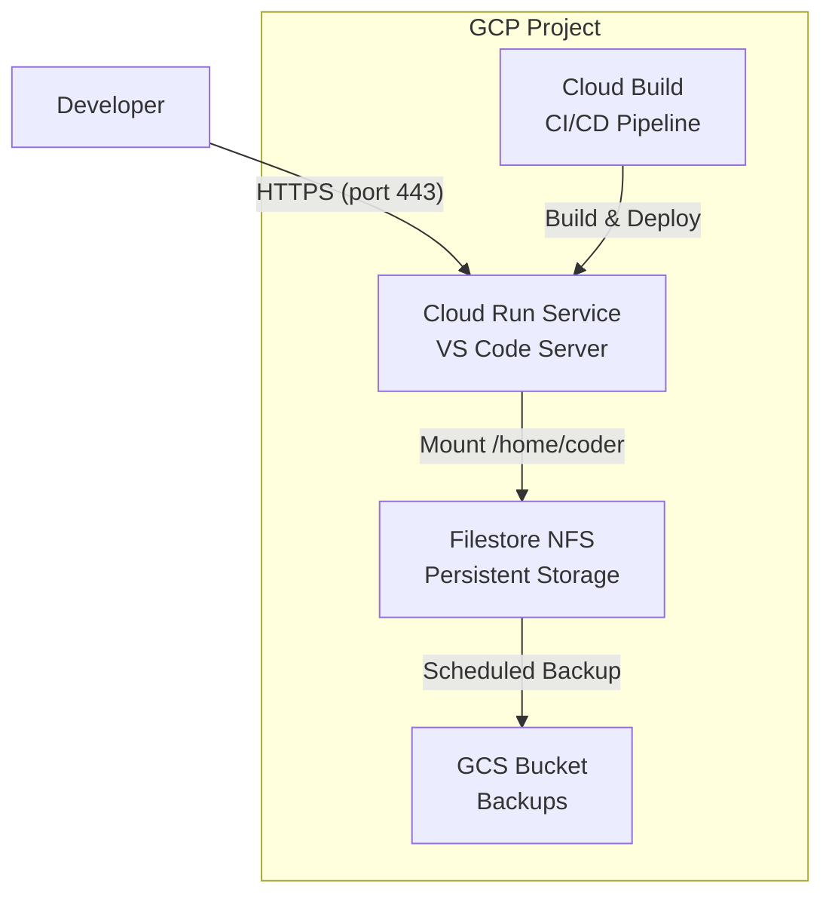

# Cloud Run Deployment for VS Code Server

This directory contains Terraform configuration to deploy a stateful VS Code Server on Google Cloud Run.

## Architecture



## Features

- **Serverless Deployment**: Runs on Cloud Run for automatic scaling and HTTPS
- **Stateful Persistence**: User workspaces, extensions, and settings persist via Filestore NFS
- **Secure Access**: Password authentication with HTTPS
- **Automated CI/CD**: Cloud Build for container builds and deployments
- **Backup Integration**: Scheduled backups to Cloud Storage

## Components

- **Dockerfile**: Custom container configuration (for future custom builds)
- **main.tf**: Cloud Run service with temporary storage
- **variables.tf**: Configuration variables
- **cloudbuild.yaml**: Build and deploy pipeline (for custom images)
- **terraform.tfvars.example**: Example configuration

**Note**: Currently uses public `codercom/code-server:latest` image for immediate deployment. Custom Dockerfile available for future enhancements.

## Statefulness

**Current Limitation**: Due to Filestore quota restrictions, this deployment uses temporary in-memory storage that persists only during the container instance lifetime.

**What this means:**
- Data persists while the Cloud Run instance is running
- Data is lost when the instance restarts or scales to zero
- Not suitable for long-term data persistence
- Good for temporary development sessions

**For true persistence**, consider:
- Increasing Filestore quota in your GCP project
- Using a different region with Filestore availability
- Implementing GCS-based persistence with gcsfuse in the container

Temporary storage:
- 1GB in-memory storage for `/home/coder`
- VS Code extensions and settings stored temporarily
- Workspaces and code files available during session

## Prerequisites

1. **Google Cloud Project** with billing enabled
2. **Required APIs enabled**:
   ```bash
   gcloud services enable run.googleapis.com
   gcloud services enable file.googleapis.com
   gcloud services enable vpcaccess.googleapis.com
   gcloud services enable cloudbuild.googleapis.com
   ```

3. **Terraform** >= 1.3.0
4. **Google Cloud SDK** (`gcloud`)

## Deployment

### 1. Clone and Setup
```bash
cd infra/workload/cloudrun
cp terraform.tfvars.example terraform.tfvars
# Edit terraform.tfvars with your project settings
```

### 2. Configure Variables
Edit `terraform.tfvars`:
```hcl
project_id = "your-gcp-project-id"
region     = "europe-west4"
vscode_password = "YourSecurePassword123"
```

### 3. Deploy Infrastructure
```bash
terraform init
terraform plan
terraform apply
```

### 4. Build and Deploy Container
```bash
# Build locally (optional)
docker build -t gcr.io/YOUR_PROJECT/vscode-server-cloudrun .

# Or use Cloud Build
gcloud builds submit --config cloudbuild.yaml .
```

### 5. Access VS Code Server
Get the URL from Terraform outputs:
```bash
terraform output cloud_run_service_url
```

Access the URL in your browser and use the configured password.

## Configuration

### Required Variables
- `project_id`: Your GCP project ID
- `region`: GCP region for deployment

### Optional Variables
- `vscode_password`: Password for VS Code access (default: P@ssw0rd@123)
- `cpu_limit`: CPU allocation (default: 1000m)
- `memory_limit`: Memory allocation (default: 2Gi)
- `filestore_capacity_gb`: NFS storage size (default: 1024GB)

## Security

- HTTPS enforced by Cloud Run
- **Authentication Options**:
  - Password authentication (default)
  - GitHub OAuth (recommended for teams)
- VPC-scoped access
- Minimal IAM permissions
- Service account with least privilege

## Operations

### Scaling
Cloud Run automatically scales based on traffic. Configure `max_instances` to limit concurrent users.

### Backups
Enable backups by setting `enable_backup = true` in variables. Data is backed up to GCS bucket.

### Updates
To update the VS Code Server version:
1. Modify the Dockerfile
2. Rebuild and redeploy the container
3. Cloud Run will handle zero-downtime updates

## GitHub OAuth Setup (Optional)

For team authentication using GitHub accounts instead of passwords:

### 1. Create GitHub OAuth App
1. Go to GitHub Settings → Developer settings → OAuth Apps
2. Click "New OAuth App"
3. Fill in:
   - **Application name**: "VS Code Server Cloud Run"
   - **Homepage URL**: `https://your-cloud-run-url`
   - **Authorization callback URL**: `https://your-cloud-run-url/login/github/callback`
4. Click "Register application"
5. Note the **Client ID** and **Client Secret**

### 2. Configure Terraform
Add to your `terraform.tfvars`:
```hcl
github_client_id = "your-client-id-here"
github_client_secret = "your-client-secret-here"
github_redirect_uri = "https://your-cloud-run-url/login/github/callback"
```

### 3. Deploy
```bash
terraform apply
```

### 4. Access
Users can now login with their GitHub accounts. Only organization members can access if you configure the OAuth app for your organization.

## Troubleshooting

### Common Issues

1. **Container won't start**
   - Check Cloud Run logs: `gcloud run logs read`
   - Verify Filestore connectivity

2. **Data not persisting**
   - Ensure Filestore is mounted correctly
   - Check service account permissions

3. **Build failures**
   - Verify Dockerfile syntax
   - Check Cloud Build permissions

### Logs
```bash
# Cloud Run logs
gcloud run logs read --region=europe-west4

# Build logs
gcloud builds log --stream
```

## Cost Optimization

- Use BASIC_SSD tier for Filestore (cheaper than PREMIUM)
- Set appropriate CPU/memory limits
- Configure max instances to control costs
- Enable backup only if needed